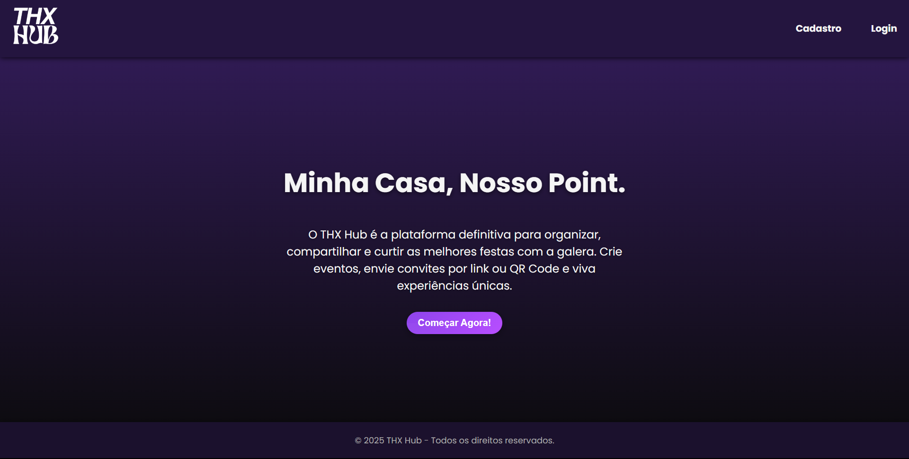
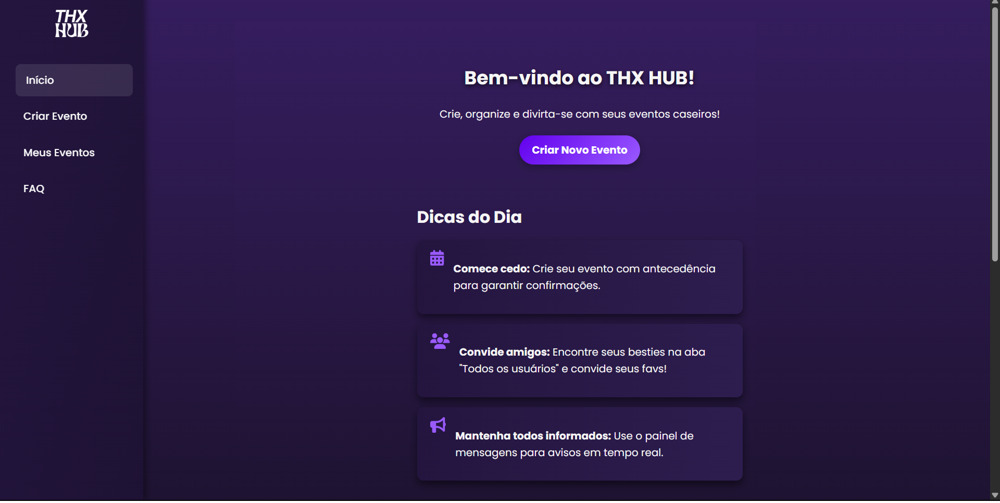
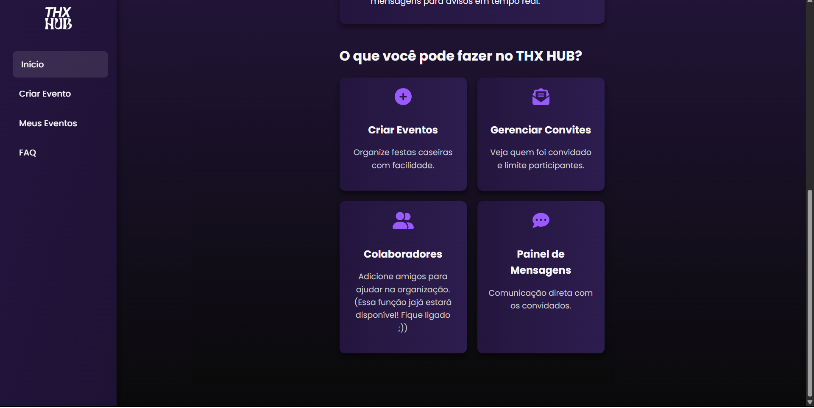
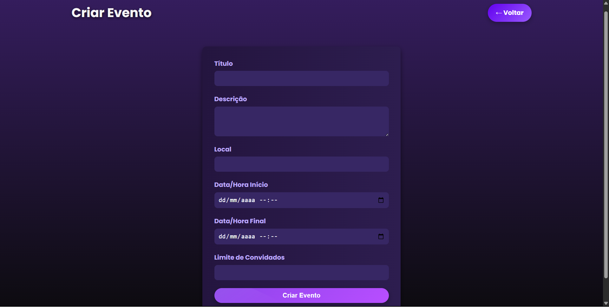
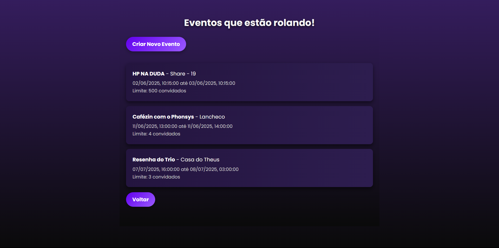
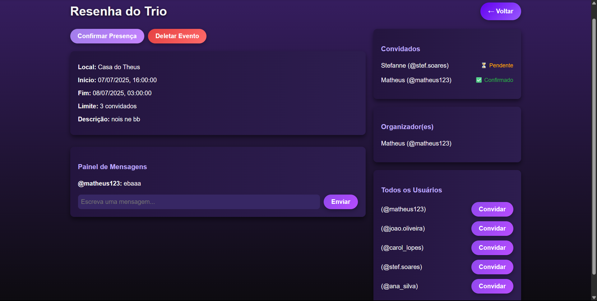

# Web Application Document - Projeto Individual - Módulo 2 - Inteli

## THXHub

#### Matheus Ferreira da Silva

## Sumário

1. [Introdução](#c1)   
2. [Projeto Técnico da Aplicação Web](#c3)  
3. [Desenvolvimento da Aplicação Web](#c4)  
4. [Referências](#c5)  

 

## 1. Introdução (Semana 01)

THX Hub é uma plataforma web desenvolvida com o objetivo de facilitar o gerenciamento de eventos pessoais, com foco especial nas “resenhas” – festas informais realizadas em casa ou no condomínio, geralmente com amigos mais próximos. A necessidade de centralizar a organização desses eventos de forma prática e eficiente tornou-se cada vez mais urgente, motivada por uma demanda real observada no cotidiano do autor do projeto e seus colegas. Essa organização engloba fatores como lista de convidados, confirmação de presenças e exibição de informações essenciais.
Com uma interface simplificada e intuitiva, o THX Hub permite que você crie um evento e defina seus principais detalhes essenciais: local, data, hora, descrição e regras. A partir dessas informações, um link de inscrição é gerado para ser facilmente compartilhado com seus convidados. Esse sistema foi pensado para promover a organização e garantir o limite de participantes adequado à capacidade do ambiente.
Além do controle de inscrições, o THX Hub possibilita ao anfitrião visualizar uma lista atualizada de confirmados, editar os dados do evento a qualquer momento e até mesmo encerrar o período de inscrições automaticamente quando o limite for atingido. Adicionalmente, é possível nomear colaboradores para auxiliar na organização, permitindo uma gestão compartilhada e mais leve.
Outra funcionalidade interessante da aplicação é a integração de um sistema de classificação entre os convidados. Com base no histórico de participação, o anfitrião pode atribuir selos como “Falta Tudo”, “Tá em Todas”, “Convidado VIP” ou criar categorias personalizadas. Essa funcionalidade torna a experiência mais engajada e reforça o espírito descontraído da plataforma.
Também está disponível um painel de mensagens exclusivo para cada evento, onde os convidados e organizadores podem se comunicar livremente. Esse recurso permite o envio de recados, dúvidas ou sugestões de forma centralizada, promovendo a interação antes, durante e após o evento.
Dessa forma, o THX Hub permite que você, anfitrião, transforme a tradicional festa em casa em uma experiência bem planejada, colaborativa e inesquecível!

---

## 2. Projeto da Aplicação Web

### 2.1. Modelagem do banco de dados

Nesta seção (2.1), serão apresentadas a modelagem lógica do banco de dados envolvendo o projeto e a explicação de suas  entidades e respectivas relações.

Nesse sentido, a modelagem lógica é o planejamento essencial de uma aplicação web, definindo seus principais elementos (dados, funcionalidades e regras) e suas interconexões, servindo como base para o desenvolvimento e garantindo um sistema bem estruturado e compreendido por todos. Assim, A arquitetura do banco de dados do THX Hub foi pensada para simplificar o gerenciamento de eventos, mapeando elementos e interações cruciais.

   Imagem 1: Modelo lógico do banco de dados 
    
   Fonte: THX Hub, 2025 (Autoral)
 

O sistema é composto por cinco tabelas principais: usuarios, eventos, organizadores_eventos, convidados_evento e mensagens_evento. A seguir, descrevemos como essas entidades se relacionam entre si.

**1. Usuários e Eventos**
A relação entre usuários e eventos no papel de organizadores é feita por meio da tabela *organizadores_eventos*. Essa tabela representa uma relação N para N, na qual um usuário pode organizar vários eventos e um evento pode ter mais de um organizador. Além disso, a tabela inclui um campo chamado `papel`, que permite registrar qual é o tipo de participação do organizador.

**2. Usuários e Eventos (relação de convite)**
A relação entre usuários e eventos no papel de convidados é registrada na tabela *convidados_evento*. Também é uma relação N para N, já que um usuário pode ser convidado para vários eventos e um evento pode ter vários convidados. Nessa tabela, há o campo `confirmado`, que indica se o convidado aceitou o convite, e o campo `data_confirmacao`, que registra quando isso ocorreu. Essa tabela permite que o organizador gerencie a lista de convidados.

**3. Usuários e Mensagens de Evento**

Por fim, a tabela *mensagens_evento* está relacionada a eventos e usuários, permitindo que usuários enviem mensagens em eventos específicos. Cada mensagem pertence a um único evento e pode estar associada a um usuário, facilitando a comunicação dentro da plataforma e mantendo o histórico das interações nos eventos.

Para acessar o modelo físico, [acesse o link aqui](https://github.com/matheusferreirq/THX-HUB/blob/main/scripts/init.sql).

### 2.1.1 BD e Models

#### Usuários (`Usuarios`)
Representa os usuários da plataforma, que podem ser anfitriões, organizadores ou convidados em eventos. Cada usuário possui os seguintes atributos:
- `id`: Identificador único do usuário (gerado automaticamente).
- `nome`: Nome completo do usuário.
- `email`: Endereço de e-mail para login e comunicação.
- `senha`: Senha criptografada para autenticação.
- `apelido_eventual`: Apelido ou nome informal opcional que o usuário pode usar.

---

#### Eventos (`Eventos`)
Modela os eventos criados na plataforma, que podem ser festas ou resenhas. Os principais atributos são:
- `id`: Identificador único do evento.
- `titulo`: Nome do evento.
- `descricao`: Descrição detalhada do evento.
- `local`: Local onde o evento será realizado.
- `data_hora_inicio`: Data e hora de início do evento.
- `data_hora_fim`: Data e hora de término do evento.
- `limite_convidados`: Quantidade máxima de convidados permitidos.

---

#### Organizadores (`Organizadores`)
Representa o vínculo entre usuários e eventos no papel de organizadores. Cada registro indica que um usuário organiza um evento com um determinado papel:
- `id`: Identificador único da associação.
- `papel`: Papel ou função do organizador no evento (ex: anfitrião, colaborador).
- `id_usuario`: Referência ao usuário organizador.
- `id_evento`: Referência ao evento organizado.

---

#### Convidados (`Convidados`)
Modela a participação dos usuários como convidados em eventos, incluindo o status da confirmação:
- `id`: Identificador único da associação.
- `confirmado`: Booleano que indica se o convite foi aceito.
- `data_confirmacao`: Data e hora em que o convite foi confirmado.
- `id_evento`: Referência ao evento.
- `id_convidado`: Referência ao usuário convidado.

---

#### Mensagens (`Mensagens`)
Representa as mensagens enviadas por usuários dentro de eventos, permitindo a comunicação entre participantes:
- `id`: Identificador único da mensagem.
- `id_evento`: Referência ao evento onde a mensagem foi enviada.
- `id_usuario`: Referência ao usuário que enviou a mensagem (pode ser nulo se o usuário for removido).
- `conteudo`: Texto da mensagem.
- `data_envio`: Data e hora do envio da mensagem.

---

Essa estrutura modular facilita a gestão dos dados, assegurando a clara separação entre entidades e seus relacionamentos na plataforma.

### 2.2. Arquitetura (Semana 5)

*Posicione aqui o diagrama de arquitetura da sua solução de aplicação web. Atualize sempre que necessário.*

**Instruções para criação do diagrama de arquitetura**  
- **Model**: A camada que lida com a lógica de negócios e interage com o banco de dados.
- **View**: A camada responsável pela interface de usuário.
- **Controller**: A camada que recebe as requisições, processa as ações e atualiza o modelo e a visualização.
  
*Adicione as setas e explicações sobre como os dados fluem entre o Model, Controller e View.*

### 2.4. Guia de estilos

O THX Hub adota uma identidade visual vibrante e noturna, inspirada no universo das festas, com foco em modernidade e clareza. A seguir, estão os principais elementos do seu guia de estilos:

#### Paleta de Cores:

- Roxo profundo (#351D5E) e roxo neon (#9A5AFF) como tons principais

- Preto absoluto (#0A0A0A) como base

- Cinza claro (#CCCCCC) e branco suave (#F5F5F5) para equilíbrio e contraste

#### Tipografia:

- Títulos e textos: Fonte Poppins (sans-serif), moderna e legível

- Logo: Fonte personalizada Lostar, com estilo marcante e festivo

####  Componentes visuais:

- Botões com gradiente roxo e bordas arredondadas

- Cards e seções com sombreamento e cores escuras vibrantes

- Sidebar vertical com transições suaves

Este conjunto visual reforça a proposta do THX Hub como um ambiente digital descontraído, porém organizado, voltado à gestão de eventos informais com estilo e personalidade.

### 2.5. Protótipo de alta fidelidade (Semana 05 - opcional)

*Posicione aqui algumas imagens demonstrativas de seu protótipo de alta fidelidade e o link para acesso ao protótipo completo (mantenha o link sempre público para visualização).*

### 2.6. WebAPI e endpoints (Semana 05)

#### Usuários (`/usuarios`)

| Método | Rota                | Descrição                                    |
|--------|---------------------|----------------------------------------------|
| GET    | `/`                 | Retorna todos os usuários                    |
| GET    | `/:id`              | Retorna um usuário específico por ID         |
| POST   | `/`                 | Cria um novo usuário                         |
| PUT    | `/:id/apelido`      | Atualiza o apelido eventual do usuário       |
| PUT    | `/:id/nome`         | Atualiza o nome do usuário                   |
| PUT    | `/:id/senha`        | Atualiza a senha do usuário                  |
| PUT    | `/:id/email`        | Atualiza o email do usuário                  |
| DELETE | `/:id`              | Remove o usuário pelo ID                     |

---

#### Eventos (`/eventos`)

| Método | Rota      | Descrição                            |
|--------|-----------|--------------------------------------|
| GET    | `/`       | Retorna todos os eventos             |
| GET    | `/:id`    | Retorna um evento específico         |
| POST   | `/`       | Cria um novo evento                  |
| PUT    | `/:id`    | Atualiza um evento existente         |
| DELETE | `/:id`    | Remove um evento pelo ID             |

---

#### Convidados (`/eventos/:id_evento/convidados`)

| Método | Rota                                                                 | Descrição                                           |
|--------|----------------------------------------------------------------------|-----------------------------------------------------|
| GET    | `/:id_evento/convidados`                                             | Lista todos os convidados de um evento              |
| GET    | `/:id_evento/confirmados`                                            | Lista apenas os convidados confirmados              |
| POST   | `/:id_evento/convidados`                                             | Convida um usuário para o evento                    |
| PUT    | `/:id_evento/convidados/:id_convidado/confirmar`                     | Confirma presença de um convidado                   |
| DELETE | `/:id_evento/convidados/:id_convidado`                               | Remove um convidado do evento                       |

---

#### Mensagens (`/eventos/:id_evento/mensagens`)

| Método | Rota                                                       | Descrição                                      |
|--------|------------------------------------------------------------|-----------------------------------------------|
| POST   | `/:id_evento/mensagens`                                    | Envia uma nova mensagem para o evento         |
| GET    | `/:id_evento/mensagens`                                    | Lista todas as mensagens de um evento         |
| DELETE | `/:id_evento/mensagens/:id_mensagens_evento`               | Remove uma mensagem específica do evento      |

---

#### Organizadores (`/organizadores`)

| Método | Rota                             | Descrição                                                      |
|--------|----------------------------------|----------------------------------------------------------------|
| GET    | `/`                              | Lista todos os organizadores                                   |
| GET    | `/evento/:id_evento`             | Lista os organizadores de um evento                            |
| GET    | `/usuario/:id_usuario`           | Lista os eventos organizados por um usuário                    |
| POST   | `/`                              | Adiciona um novo organizador a um evento                       |
| PUT    | `/:id_usuario/:id_evento`        | Atualiza o papel de um organizador                             |
| DELETE | `/:id_usuario/:id_evento`        | Remove um organizador específico de um evento                  |

### 2.7 Interface e Navegação

Nesta subseção (2.7), será detalhado o fluxo de navegação desenvolvido para a aplicação, apresentando suas respectivas telas e as relações entre elas.

A princípio, com base no guia de estilos, foi customizado e estruturado todo o front-end do THX Hub. Essa camada de interface com o usuário, que exibe informações do back-end (consultas ao banco de dados e validações), foi projetada para facilitar o monitoramento e a criação de eventos no WebApp. Para isso, as seguintes telas foram desenvolvidas:
- Landing page
- Home page
- Tela de criação de eventos
- Tela de eventos disponíveis
- Tela de detalhes do evento.

   Imagem 2: Landing page 
    
   Fonte: THX Hub, 2025 (Autoral)
 

A landing page foi pensada para ser convidativa, com uma pequena descrição que atrai os usuários e três botões. O botão "Começar agora!" direciona diretamente para a home page do aplicativo. Atualmente, os botões de "cadastro" e "login" ainda estão em desenvolvimento e não possuem funcionalidade.

 

   Imagem 3: Home page 
    
   Fonte: THX Hub, 2025 (Autoral)
 

  

   Imagem 4: Home page 
    
   Fonte: THX Hub, 2025 (Autoral)
 

A home page oferece uma barra de navegação intuitiva que permite acesso rápido às principais seções do aplicativo: criação de eventos, eventos disponíveis e uma aba de FAQ (Perguntas Frequentes). No conteúdo principal, você encontrará dicas úteis para organizar seus eventos e uma seção destacando as funcionalidades do THX Hub. Para otimizar a experiência, um atalho para a criação de eventos está visível no início da página, facilitando o acesso rápido.

  

   Imagem 5: Tela de criação de eventos 
    
   Fonte: THX Hub, 2025 (Autoral)
 

Nesta tela, você pode inserir todas as informações essenciais do seu evento, que serão exibidas para que outros usuários possam interagir. Ela inclui campos para título, descrição, local, data e hora de início, data e hora final, e limite de convidados.

  

   Imagem 6: Tela de eventos disponíveis 
    
   Fonte: THX Hub, 2025 (Autoral)
 

Aqui, as informações principais de cada evento ativo são apresentadas. Os nomes dos eventos são clicáveis, permitindo que os usuários acessem detalhes adicionais. O botão "voltar" redireciona para a tela de exibição de eventos, e o botão "Criar novo evento" leva o usuário diretamente para a tela de criação já mencionada (Imagem 5), agilizando o processo.

  

   Imagem 7: Tela de detalhes do evento 
    
   Fonte: THX Hub, 2025 (Autoral)
 

Cada evento possui uma estrutura detalhada, organizada da seguinte forma:

- Um primeiro bloco com os dados principais inseridos na criação do evento.
- Um painel de mensagens, que serve como um facilitador crucial para a comunicação entre os participantes.
- Uma seção dedicada aos convidados do evento e seu status de confirmação.
- Uma aba que exibe o(s) organizador(es) do evento.
- Uma lista com todos os usuários cadastrados no THX Hub, para facilitar o envio de convites.

Este mapeamento do fluxo de navegação e das telas do THX Hub evidencia uma abordagem centrada no usuário, com o objetivo de simplificar a criação e o acesso a eventos, tornando esse processo algo muito mais simples e intuitivo!

---

## 3. Desenvolvimento da Aplicação Web (Semana 8)

### 3.1 Demonstração do Sistema Web (Semana 8)

*VIDEO: Insira o link do vídeo demonstrativo nesta seção*
*Descreva e ilustre aqui o desenvolvimento do sistema web completo, explicando brevemente o que foi entregue em termos de código e sistema. Utilize prints de tela para ilustrar.*

### 3.2 Conclusões e Trabalhos Futuros (Semana 8)

*Indique pontos fortes e pontos a melhorar de maneira geral.*
*Relacione também quaisquer outras ideias que você tenha para melhorias futuras.*

## 4. Referências

_Incluir as principais referências de seu projeto, para que o leitor possa consultar caso ele se interessar em aprofundar._ 

---