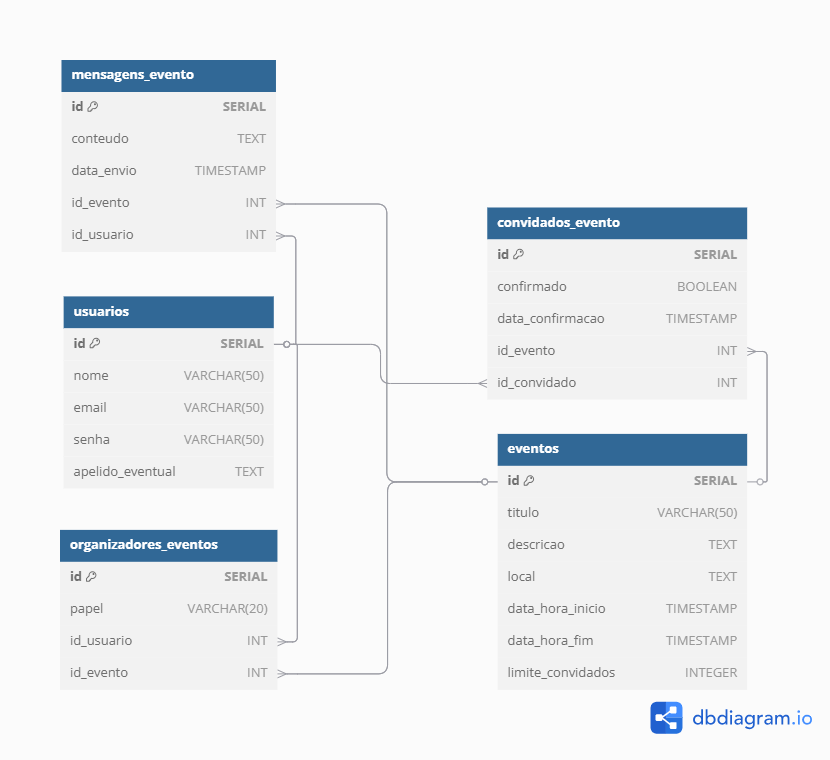

# Web Application Document - Projeto Individual - Módulo 2 - Inteli

## THXHub

#### Matheus Ferreira da Silva

## Sumário

1. [Introdução](#c1)  
2. [Visão Geral da Aplicação Web](#c2)  
3. [Projeto Técnico da Aplicação Web](#c3)  
4. [Desenvolvimento da Aplicação Web](#c4)  
5. [Referências](#c5)  

 

## 1. Introdução (Semana 01)

THX Hub é uma plataforma web desenvolvida com o objetivo de facilitar o gerenciamento de eventos pessoais, com foco especial nas “resenhas” – festas informais realizadas em casa ou no condomínio, geralmente com amigos mais próximos. A necessidade de centralizar a organização desses eventos de forma prática e eficiente tornou-se cada vez mais urgente, motivada por uma demanda real observada no cotidiano do autor do projeto e seus colegas. Essa organização engloba fatores como lista de convidados, confirmação de presenças e exibição de informações essenciais.
Com uma interface simplificada e intuitiva, o THX Hub permite que você crie um evento e defina seus principais detalhes essenciais: local, data, hora, descrição e regras. A partir dessas informações, um link de inscrição é gerado para ser facilmente compartilhado com seus convidados. Esse sistema foi pensado para promover a organização e garantir o limite de participantes adequado à capacidade do ambiente.
Além do controle de inscrições, o THX Hub possibilita ao anfitrião visualizar uma lista atualizada de confirmados, editar os dados do evento a qualquer momento e até mesmo encerrar o período de inscrições automaticamente quando o limite for atingido. Adicionalmente, é possível nomear colaboradores para auxiliar na organização, permitindo uma gestão compartilhada e mais leve.
Outra funcionalidade interessante da aplicação é a integração de um sistema de classificação entre os convidados. Com base no histórico de participação, o anfitrião pode atribuir selos como “Falta Tudo”, “Tá em Todas”, “Convidado VIP” ou criar categorias personalizadas. Essa funcionalidade torna a experiência mais engajada e reforça o espírito descontraído da plataforma.
Dessa forma, o THX Hub permite que você, anfitrião, transforme a tradicional festa em casa em uma experiência bem planejada, colaborativa e inesquecível!

---

## 2. Visão Geral da Aplicação Web

### 2.1. Personas (Semana 01 - opcional)

*Posicione aqui sua(s) Persona(s) em forma de texto markdown com imagens, ou como imagem de template preenchido. Atualize esta seção ao longo do módulo se necessário.*

### 2.2. User Stories (Semana 01 - opcional)

*Posicione aqui a lista de User Stories levantadas para o projeto. Siga o template de User Stories e utilize a referência USXX para numeração (US01, US02, US03, ...). Indique todas as User Stories mapeadas, mesmo aquelas que não forem implementadas ao longo do projeto. Não se esqueça de explicar o INVEST de 1 User Storie prioritária.*

---

## 3. Projeto da Aplicação Web

### 3.1. Modelagem do banco de dados  (Semana 3)

Nesta seção (3.1), serão apresentadas a modelagem lógica do banco de dados envolvendo o projeto e a explicação de suas  entidades e respectivas relações.

Nesse sentido, a modelagem lógica é o planejamento essencial de uma aplicação web, definindo seus principais elementos (dados, funcionalidades e regras) e suas interconexões, servindo como base para o desenvolvimento e garantindo um sistema bem estruturado e compreendido por todos. Assim, A arquitetura do banco de dados do THX Hub foi pensada para simplificar o gerenciamento de eventos, mapeando elementos e interações cruciais.

   Imagem 1: Modelo lógico do banco de dados 
    
   Fonte: THX Hub, 2025 (Autoral)
 

O sistema é composto por cinco tabelas principais: usuarios, eventos, organizadores_eventos, convidados_evento e inscricoes. A seguir, descrevemos como essas entidades se relacionam entre si.

**1. Usuários e Eventos**
A relação entre usuários e eventos no papel de organizadores é feita por meio da tabela *organizadores_eventos*. Essa tabela representa uma relação N para N, na qual um usuário pode organizar vários eventos e um evento pode ter mais de um organizador. Além disso, a tabela inclui um campo chamado `papel`, que permite registrar qual é o tipo de participação do organizador.

**2. Usuários e Eventos (relação de convite)**
A relação entre usuários e eventos no papel de convidados é registrada na tabela *convidados_evento*. Também é uma relação N para N, já que um usuário pode ser convidado para vários eventos e um evento pode ter vários convidados. Nessa tabela, há o campo `confirmado`, que indica se o convidado aceitou o convite, e o campo `data_confirmacao`, que registra quando isso ocorreu. Essa tabela permite que o organizador gerencie a lista de convidados.

**3. Usuários e Mensagens de Evento**

Por fim, a tabela *mensagens_evento* está relacionada a eventos e usuários, permitindo que usuários enviem mensagens em eventos específicos. Cada mensagem pertence a um único evento e pode estar associada a um usuário, facilitando a comunicação dentro da plataforma e mantendo o histórico das interações nos eventos.

Para acessar o modelo físico, [acesse o link aqui](https://github.com/matheusferreirq/THX-HUB/blob/main/scripts/init.sql).

### 3.1.1 BD e Models (Semana 5)

#### Usuários (`Usuarios`)
Representa os usuários da plataforma, que podem ser anfitriões, organizadores ou convidados em eventos. Cada usuário possui os seguintes atributos:
- `id`: Identificador único do usuário (gerado automaticamente).
- `nome`: Nome completo do usuário.
- `email`: Endereço de e-mail para login e comunicação.
- `senha`: Senha criptografada para autenticação.
- `apelido_eventual`: Apelido ou nome informal opcional que o usuário pode usar.

---

#### Eventos (`Eventos`)
Modela os eventos criados na plataforma, que podem ser festas ou resenhas. Os principais atributos são:
- `id`: Identificador único do evento.
- `titulo`: Nome do evento.
- `descricao`: Descrição detalhada do evento.
- `local`: Local onde o evento será realizado.
- `data_hora_inicio`: Data e hora de início do evento.
- `data_hora_fim`: Data e hora de término do evento.
- `limite_convidados`: Quantidade máxima de convidados permitidos.

---

#### Organizadores (`Organizadores`)
Representa o vínculo entre usuários e eventos no papel de organizadores. Cada registro indica que um usuário organiza um evento com um determinado papel:
- `id`: Identificador único da associação.
- `papel`: Papel ou função do organizador no evento (ex: anfitrião, colaborador).
- `id_usuario`: Referência ao usuário organizador.
- `id_evento`: Referência ao evento organizado.

---

#### Convidados (`Convidados`)
Modela a participação dos usuários como convidados em eventos, incluindo o status da confirmação:
- `id`: Identificador único da associação.
- `confirmado`: Booleano que indica se o convite foi aceito.
- `data_confirmacao`: Data e hora em que o convite foi confirmado.
- `id_evento`: Referência ao evento.
- `id_convidado`: Referência ao usuário convidado.

---

#### Mensagens (`Mensagens`)
Representa as mensagens enviadas por usuários dentro de eventos, permitindo a comunicação entre participantes:
- `id`: Identificador único da mensagem.
- `id_evento`: Referência ao evento onde a mensagem foi enviada.
- `id_usuario`: Referência ao usuário que enviou a mensagem (pode ser nulo se o usuário for removido).
- `conteudo`: Texto da mensagem.
- `data_envio`: Data e hora do envio da mensagem.

---

Essa estrutura modular facilita a gestão dos dados, assegurando a clara separação entre entidades e seus relacionamentos na plataforma.

### 3.2. Arquitetura (Semana 5)

*Posicione aqui o diagrama de arquitetura da sua solução de aplicação web. Atualize sempre que necessário.*

**Instruções para criação do diagrama de arquitetura**  
- **Model**: A camada que lida com a lógica de negócios e interage com o banco de dados.
- **View**: A camada responsável pela interface de usuário.
- **Controller**: A camada que recebe as requisições, processa as ações e atualiza o modelo e a visualização.
  
*Adicione as setas e explicações sobre como os dados fluem entre o Model, Controller e View.*

### 3.3. Wireframes (Semana 03 - opcional)

*Posicione aqui as imagens do wireframe construído para sua solução e, opcionalmente, o link para acesso (mantenha o link sempre público para visualização).*

### 3.4. Guia de estilos (Semana 05 - opcional)

*Descreva aqui orientações gerais para o leitor sobre como utilizar os componentes do guia de estilos de sua solução.*

### 3.5. Protótipo de alta fidelidade (Semana 05 - opcional)

*Posicione aqui algumas imagens demonstrativas de seu protótipo de alta fidelidade e o link para acesso ao protótipo completo (mantenha o link sempre público para visualização).*

### 3.6. WebAPI e endpoints (Semana 05)

*Utilize um link para outra página de documentação contendo a descrição completa de cada endpoint. Ou descreva aqui cada endpoint criado para seu sistema.*  

### 3.7 Interface e Navegação (Semana 07)

*Descreva e ilustre aqui o desenvolvimento do frontend do sistema web, explicando brevemente o que foi entregue em termos de código e sistema. Utilize prints de tela para ilustrar.*

---

## 4. Desenvolvimento da Aplicação Web (Semana 8)

### 4.1 Demonstração do Sistema Web (Semana 8)

*VIDEO: Insira o link do vídeo demonstrativo nesta seção*
*Descreva e ilustre aqui o desenvolvimento do sistema web completo, explicando brevemente o que foi entregue em termos de código e sistema. Utilize prints de tela para ilustrar.*

### 4.2 Conclusões e Trabalhos Futuros (Semana 8)

*Indique pontos fortes e pontos a melhorar de maneira geral.*
*Relacione também quaisquer outras ideias que você tenha para melhorias futuras.*

## 5. Referências

_Incluir as principais referências de seu projeto, para que o leitor possa consultar caso ele se interessar em aprofundar._ 

---
---